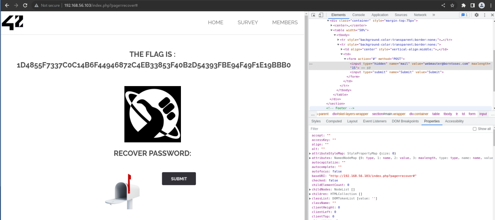

On the home page, click on the Sign In button.
-> I forgot my password

When analyzing the submit button, we can see a hidden form input:  
```
<input type="hidden" name="mail" value="webmaster@borntosec.com" maxlength="15">
```  
If we change the value to anything else, and then click on submit, we get the flag.




How to prevent this:  
All inputs should be managed and manipulated in the backend.