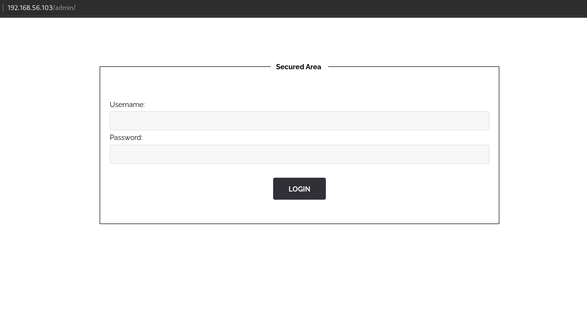

# Solution

```
curl -X GET http://192.168.56.103/whatever/htpasswd
```


I looked through all the website and couldn't find anything I could exploit, so I wondered if there would be any hidden pages:  
https://www.mindspun.com/blog/find-hidden-page/  

> robots.txt files are used to hide pages from a search engine index.  
We can access it by adding /robots.txt at the end of the URL.  

We see the following:  
  

  


*htpasswd* stores usernames and passwords for basic authentication of HTTP users.

```
curl -X GET http://192.168.56.103/whatever/htpasswd
root:437394baff5aa33daa618be47b75cb49
```

the password is encryted:  
`437394baff5aa33daa618be47b75cb49 : qwerty123@`

Using this password on the signin page doesn't work.  
There is no other visible login page, but we can find all the website directories using dirb.  
Dirb enumerates all the directories of a website.  

  

We see an admin directory.  
We have a login page at 192.168.56.103/admin.  

  

Using root / qwerty123@, we get a flag !

  

To prevent this, do not store sensitive information in the robots.txt file, and use a harder encryption algorithm.  


<!-- https://md5decrypt.net/en/ -->
