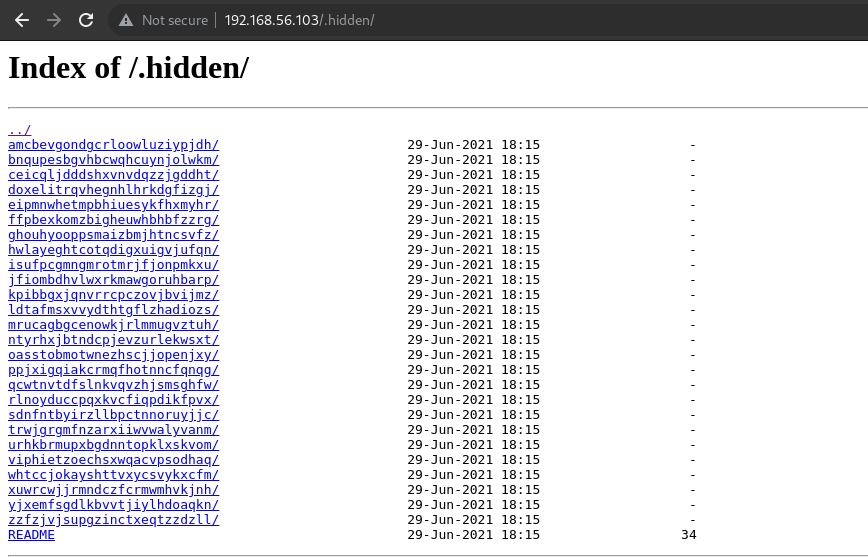

# Solution

```
$> wget -e robots=off -r --no-parent 'http://192.168.56.103/.hidden/'
$> cd 192.168.56.103/.hidden
$> find . -name "README" -exec grep 'flag' {} +
```


I looked through all the website and couldn't find anything I could exploit, so I wondered if there would be any hidden pages:  
https://www.mindspun.com/blog/find-hidden-page/  

> robots.txt files are used to hide pages from a search engine index.  
We can access it by adding /robots.txt at the end of the URL.  

We see the following:  
  

  

-> There is a README file in each folder. A lot of them...

- Download all the files locally (in /tmp)
```
wget -e robots=off -r --no-parent 'http://192.168.56.103/.hidden/'
```
-e robots=off : execute + ignore robots file  
-r : recursive
--no-parent : Do not ever ascend to the parent directory when retrieving
           recursively.  This is a useful option, since it guarantees that
           only the files below a certain hierarchy will be downloaded.

```
$> cd 192.168.56.103/.hidden

$> find . -name "README" -exec grep 'flag' {} +
./whtccjokayshttvxycsvykxcfm/igeemtxnvexvxezqwntmzjltkt/lmpanswobhwcozdqixbowvbrhw/README:Hey, here is your flag : d5eec3ec36cf80dce44a896f961c1831a05526ec215693c8f2c39543497d4466
```

The find command is comprised of two main parts, the expression and the action.
The -exec action allows us to execute commands on the resulting paths.

The arguments passed to the -exec flag, which include:
The command: file
The result placeholder: {}
A command delimiter: \; or +  
We need to provide the find command with a delimiter so it’ll know where our -exec arguments stop.

To prevent this, do not store sensitive information in the robots.txt file.  

https://www.baeldung.com/linux/find-exec-command