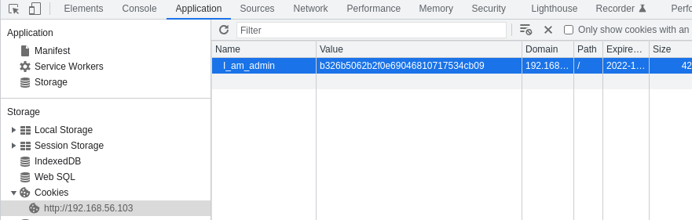

When inspecting the website, we see a cookie named "I_am_admin".  
With dcode.fr, we see that the cookie's value is hashed in MD5, which is a pretty weak hashing algorithm.  
68934a3e9455fa72420237eb05902327 = false.  

Let's hash true : b326b5062b2f0e69046810717534cb09.

By changing the cookie value and clicking on sign in, we get the flag.  
df2eb4ba34ed059a1e3e89ff4dfc13445f104a1a52295214def1c4fb1693a5c

This session cookie contains sensitive information (probably a token used to authentify the admin) and its value is public. It is not safe because a third-party can retrieve this token and impersonate the admin to access certain parts of the website he is not allowed to access.

To prevent this, do not use cookies to store sensitive information, and use a more complex hashing algorithm.  

